# Like Bach: Harmonic Generative Engine v4.6

    
바흐의 4성부 화성 체계를 완벽히 학습하고, DeepBach 및 BachBot의 선진 알고리즘을 이식하여 음악적 논리성과 구조적 완결성을 극대화한 통합 작곡 엔진입니다. 이번 v4.6 업데이트를 통해 데이터 전처리 파이프라인의 오프셋 추출 로직을 전면 수정하였으며, 프론트엔드의 렌더링 및 재생 동기화 기능이 대폭 향상되었습니다.

## Key Features (v4.6 Update)

- 4-Voice Integrated Harmony: 소프라노 주제 입력 시 알토, 테너, 베이스를 유기적으로 동시 생성합니다.
- Functional Harmony Awareness: 로마자 화성 기호([ROMAN_I], [ROMAN_V7] 등)를 명시적으로 학습하여 화성적 개연성과 음악적 정통성을 확보했습니다.
- Structural Measure Control: 마디 카운트다운([REMAIN_N]) 및 종지([FINAL]) 토큰을 통해 사용자가 원하는 길이를 제어하고 자연스러운 마무리가 가능합니다.
- Global Offset Training: 곡의 수평적, 수직적 화성을 온전히 학습하기 위해 절대 오프셋 기반의 훈련 데이터 추출 로직을 새롭게 적용했습니다. (v4.5의 Local Offset 버그 수정)
- Interactive Playback UI: Tone.js와 VexFlow를 연동하여, 재생 시 실시간으로 현재 연주되는 음표가 하이라이팅되며 악보 전체가 부드럽게 횡스크롤됩니다.
- Accurate Stem Rendering: 4성부의 기둥 방향(소프라노/테너 위, 알토/베이스 아래)을 완벽하게 분리 렌더링하여 악보 가독성을 극대화했습니다.
- Engine Stability & Control: V5 하이브리드 엔진의 무한 루프 버그(Continuation 중단 현상)를 완벽하게 수정하였으며, 프론트엔드에서 직접 백엔드를 기동/종료하고 템포(BPM)를 조절할 수 있는 기능을 추가했습니다.

## 시스템 아키텍처

```mermaid
graph TD
    %% 스타일 정의
    classDef data fill:#2b2b2b,stroke:#4f4f4f,stroke-width:2px;
    classDef engine fill:#1a365d,stroke:#2b6cb0,stroke-width:2px,color:#fff;
    classDef control fill:#744210,stroke:#d69e2e,stroke-width:2px,color:#fff;
    classDef ui fill:#234e52,stroke:#319795,stroke-width:2px,color:#fff;

    %% 1. 데이터 엔지니어링 파트
    A[Raw MIDI Data] --> B(music21 Parser)
    B --> C[Global Offset Interleaved Tokens]
    B --> D[Automated Roman Numeral Context]

    %% 2. 추론 및 실시간 제어 파트 (Dual Engine & Logits Warping)
    C & D --> E{Dual Neural Engine Selection}
    
    subgraph Inference_Loop [Inference Runtime]
        E -->|Homophony| F[Chorale Engine 25M]
        E -->|Polyphony| G[Fugue Engine 25M~340M]
        
        F & G --> H[Next Token Logits]
        H --> I[Logits Warping Engine _filter_logits]
        I -->|Anti-Parallelism Masking| J[Strict Harmonic Constraint Evaluation]
        J -->|Feedback & Token Sampling| H
    end

    %% 3. 비동기 브로커 및 프론트엔드 동기화
    J -->|Sampled Stream| K[FastAPI Async Broker]
    
    subgraph Frontend_Studio [React Interactive Studio]
        K -->|Async Streaming| L[State Manager]
        L -->|Microtask Queue Sync| M[VexFlow Score Renderer]
        L -->|Microtask Queue Sync| N[Tone.js Audio Synthesizer]
        M & N --> O[Dynamic Stem Rendering & Real-time H-Scroll Highlighting]
    end

    %% 클래스 지정
    class A,C,D,H data;
    class F,G engine;
    class I,J control;
    class M,N,O ui;
```



### 1. Data Engineering & Interleaving Pipeline
- **Global Offset Alignment:** 성부 간의 수직적 화성 관계와 수평적 대위적 흐름을 보존하기 위해, 전통적인 순차적 나열 방식을 배제하고 절대 시간(Global Offset) 기반의 인터리빙(Interleaving) 토큰 파이프라인을 적용했습니다. 이를 통해 성부 교차 및 휴지기(Rest) 상황에서도 데이터 오염 없이 학습이 가능합니다.
- **Automated Harmonic Analysis:** `music21` 라이브러리를 활용하여 원본 MIDI 데이터로부터 Key 중심의 전조(Modulation) 분석 및 로마자 화성 기호([ROMAN_I], [ROMAN_V7] 등)를 자동으로 추출하여 컨텍스트 토큰으로 주입합니다.

### 2. Dual Neural Engine Inference (Phase 2)
- **Chorale Engine (25M):** 수직적 홈포니(Homophony)에 최적화되어 있으며, 화성적 개연성과 코드 전개(Roman Numeral Context)를 기반으로 4성부를 유기적으로 동시 생성합니다.
- **Fugue Engine (25M~340M Scalable):** 수평적 폴리포니(Polyphony)에 특화된 모델로, 거시 구조 토큰(`[SUBJECT]`, `[ANSWER]`, `[EPISODE]`)을 해석하여 모방 대위법을 구사합니다. 입력된 주제에 대해 내장 성부가 정확히 5도 이조(Transposition)된 답창을 모방하도록 유도합니다.

### 3. Real-time Constraint Control via Logits Warping
- **In-flight Harmonic Filtering:** 생성 완료 후 사후적으로 오류를 수정하는 In-painting 방식의 Latency 저하 문제를 해결하기 위해, 추론(Inference) 단계의 `_filter_logits` 엔진 내에 **Logits Warping** 메커니즘을 내장했습니다.
- **Anti-Parallelism Masking:** 모델이 다음 토큰을 샘플링하기 직전, 대위법적 금기 사항(병행 5도, 병행 8도 등)을 유발할 수 있는 음정 토큰의 확률(Logits)을 마스킹하여, 실시간 추론 속도를 보존하면서도 엄격한 화성학 규칙을 강제합니다.

### 4. Interactive Studio Sync
- **FastAPI Async Broker:** 백엔드 API는 비동기 스트리밍 인터페이스를 제공하여 대용량 컨텍스트 추론 중에도 프론트엔드와의 연결 리소스를 최적화합니다.
- **Dynamic Render & Playback:** 프론트엔드 스튜디오(React)는 `VexFlow`와 `Tone.js`를 동기화 마이크로태스크 큐로 제어합니다. 재생 헤드의 이동에 맞춰 악보의 4성부 스템(Stem) 기둥 방향을 분리 렌더링함과 동시에 실시간 횡스크롤 하이라이팅을 수행합니다.

## 설치 및 실행 가이드

1. 환경:
   Python 3.10+ 및 CUDA 지원 GPU(RTX 4080/5080 권장) 필요, Node.js 20+

2. 학습 전처리 시작:
   ```bash
   python src/v4/preprocess.py
   ```

3. 학습 시작:
   ```bash
   python src/v4/train.py
   ```

4. 백엔드 서버 실행:
   ```bash
   python src/v4/api.py
   ```

5. 프론트 실행:
   ```bash
   cd ui/v4-app
   npm run dev
   ```

6. 푸가 엔진 실행:
   ```bash
   python scripts/preprocess_fugue.py
   python scripts/train_fugue.py
   ```

## 지속적 통합 (CI/CD)

이 프로젝트는 코드 품질 관리 및 협업 시의 안정성 확보를 위해 GitHub Actions 기반의 지속적 통합(CI) 파이프라인을 가동하고 있습니다.

1. 자동화 워크플로우 (GitHub Actions):
- 트리거 조건: main 브랜치 및 feature/algorithm-enhancement 브랜치로의 push 및 pull_request 발생 시 실행
- 백엔드 검증 (backend-ci): Python 3.10 환경에서 ruff 정적 분석 도구를 이용한 코드 린팅 검사 및 pytest 기반 단위 테스트 자동 구동
- 프론트엔드 검증 (frontend-ci): Node.js 20 환경에서 ESLint 정적 분석 검사 및 Vite 프로덕션 빌드 성공 여부를 병렬 수행

## Development History

상세한 기술 개발 과정 및 최적화 이력은 development_log.txt에서 확인할 수 있습니다. 오염된 이전 버전의 모델과 실패 기록은 legacy/v4.5-bugged 브랜치에 안전하게 격리 보관되어 있습니다.

## Future Work

- **1. 오디오 합성 및 MIDI 렌더링 고도화**
  - Tone.js의 단순 Synth를 넘어, FluidSynth 기반의 사운드폰트(SoundFont)나 Web Audio API를 활용하여 실제 파이프 오르간, 쳄발로 사운드 렌더링 품질을 크게 향상시켜야 합니다.
- **3. 자동 재작곡 루프 강화 및 오류 교정**
  - 이미 도입된 화성 평가(Harmonic Evaluation) 기반의 조건부 루프를 더욱 엄격하게 튜닝하여, 병행 5/8도 등 대위법적 금기 사항이 발생할 경우 엔진 스스로 해당 마디를 부분 재수정(In-painting)하도록 알고리즘을 고도화해야 합니다.
