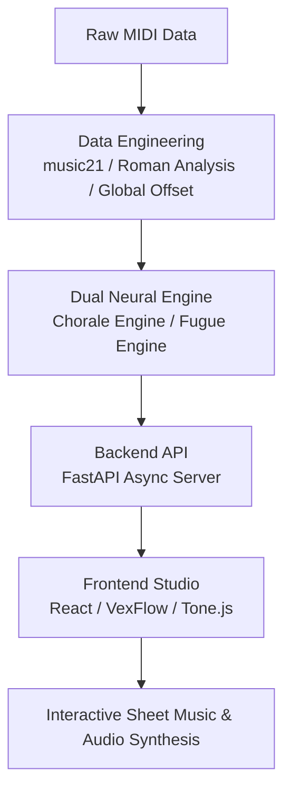

# Like Bach: Harmonic Generative Engine v4.6

    
바흐의 4성부 화성 체계를 완벽히 학습하고, DeepBach 및 BachBot의 선진 알고리즘을 이식하여 음악적 논리성과 구조적 완결성을 극대화한 통합 작곡 엔진입니다. 이번 v4.6 업데이트를 통해 데이터 전처리 파이프라인의 오프셋 추출 로직을 전면 수정하였으며, 프론트엔드의 렌더링 및 재생 동기화 기능이 대폭 향상되었습니다.

## Key Features (v4.6 Update)

- 4-Voice Integrated Harmony: 소프라노 주제 입력 시 알토, 테너, 베이스를 유기적으로 동시 생성합니다.
- Functional Harmony Awareness: 로마자 화성 기호([ROMAN_I], [ROMAN_V7] 등)를 명시적으로 학습하여 화성적 개연성과 음악적 정통성을 확보했습니다.
- Structural Measure Control: 마디 카운트다운([REMAIN_N]) 및 종지([FINAL]) 토큰을 통해 사용자가 원하는 길이를 제어하고 자연스러운 마무리가 가능합니다.
- Global Offset Training: 곡의 수평적, 수직적 화성을 온전히 학습하기 위해 절대 오프셋 기반의 훈련 데이터 추출 로직을 새롭게 적용했습니다. (v4.5의 Local Offset 버그 수정)
- Interactive Playback UI: Tone.js와 VexFlow를 연동하여, 재생 시 실시간으로 현재 연주되는 음표가 하이라이팅되며 악보 전체가 부드럽게 횡스크롤됩니다.
- Accurate Stem Rendering: 4성부의 기둥 방향(소프라노/테너 위, 알토/베이스 아래)을 완벽하게 분리 렌더링하여 악보 가독성을 극대화했습니다.
- Engine Stability & Control: V5 하이브리드 엔진의 무한 루프 버그(Continuation 중단 현상)를 완벽하게 수정하였으며, 프론트엔드에서 직접 백엔드를 기동/종료하고 템포(BPM)를 조절할 수 있는 기능을 추가했습니다.

## Technical Architecture



### Dual-Engine Architecture (Chorale vs Fugue)
v4.6부터는 수직적 코랄과 수평적 푸가의 본질적인 질감 차이를 완벽히 구현하기 위해 독립적인 듀얼 엔진 구조(Phase 2)를 채택했습니다.
- Chorale Engine (bach_model.pt): 화성의 수직적 결합(Homophony)과 코드 진행(Roman Numeral) 학습에 특화된 모델입니다. 4성부가 동일한 박자 구조 안에서 규칙적으로 움직이는 찬송가풍 음악 생성에 적합합니다.
- Fugue Engine (fugue_model.pt): 성부의 수평적 독립성(Polyphony)과 모방 대위법 학습에 특화된 전용 모델입니다. [SUBJECT], [ANSWER], [EPISODE]와 같은 거시적 구조 토큰을 학습하여, 각 성부가 서로 다른 리듬으로 교차하며 기승전결을 전개합니다.

### Components
- Neural Engine: Transformer-based Generative Models (25M Parameters per engine)
- Data Engineering: music21 기반의 고도화된 로마자 화성 분석, 전조 분석 및 절대 시간(Global Offset) 인터리빙 토큰 파이프라인
- Frontend Studio: React, Vite, VexFlow(악보 렌더링), Tone.js(오디오 신디사이저) 기반의 통합 UI 스튜디오
- Backend API: FastAPI 기반의 비동기 추론 서버

## Getting Started

1. 환경:
   Python 3.10+ 및 CUDA 지원 GPU(RTX 4080/5080 권장) 필요, Node.js 20+

2. 학습 전처리 시작:
   ```bash
   python src/v4/preprocess.py
   ```

3. 학습 시작:
   ```bash
   python src/v4/train.py
   ```

4. 백엔드 서버 실행:
   ```bash
   python src/v4/api.py
   ```

5. 프론트 실행:
   ```bash
   cd ui/v4-app
   npm run dev
   ```

6. 푸가 엔진 실행:
   ```bash
   python scripts/preprocess_fugue.py
   python scripts/train_fugue.py
   ```

## Continuous Integration

이 프로젝트는 코드 품질 관리 및 협업 시의 안정성 확보를 위해 GitHub Actions 기반의 지속적 통합(CI) 파이프라인을 가동하고 있습니다.

1. 자동화 워크플로우 (GitHub Actions):
- 트리거 조건: main 브랜치 및 feature/algorithm-enhancement 브랜치로의 push 및 pull_request 발생 시 실행
- 백엔드 검증 (backend-ci): Python 3.10 환경에서 ruff 정적 분석 도구를 이용한 코드 린팅 검사 및 pytest 기반 단위 테스트 자동 구동
- 프론트엔드 검증 (frontend-ci): Node.js 20 환경에서 ESLint 정적 분석 검사 및 Vite 프로덕션 빌드 성공 여부를 병렬 수행

## Development History

상세한 기술 개발 과정 및 최적화 이력은 development_log.txt에서 확인할 수 있습니다. 오염된 이전 버전의 모델과 실패 기록은 legacy/v4.5-bugged 브랜치에 안전하게 격리 보관되어 있습니다.

## Future Work

- **1. 오디오 합성 및 MIDI 렌더링 고도화**
  - Tone.js의 단순 Synth를 넘어, FluidSynth 기반의 사운드폰트(SoundFont)나 Web Audio API를 활용하여 실제 파이프 오르간, 쳄발로 사운드 렌더링 품질을 크게 향상시켜야 합니다.
- **3. 자동 재작곡 루프 강화 및 오류 교정**
  - 이미 도입된 화성 평가(Harmonic Evaluation) 기반의 조건부 루프를 더욱 엄격하게 튜닝하여, 병행 5/8도 등 대위법적 금기 사항이 발생할 경우 엔진 스스로 해당 마디를 부분 재수정(In-painting)하도록 알고리즘을 고도화해야 합니다.
