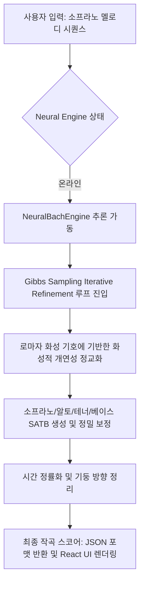

# Like Bach Harmonic Generative Engine: Architectural Specification

본 문서는 Like Bach 생성 엔진의 심층적인 신경망 아키텍처, Gibbs Sampling 작곡 흐름, 그리고 대위법 규칙 엔진의 기술적 메커니즘을 상세히 명세합니다.

## 시스템 동작 흐름 (System Flow Diagram)

소프라노 입력 주제선율로부터 최종 SATB 4성부 스코어가 렌더링되기까지의 통합 흐름도입니다.

## 핵심 모듈별 상세 스펙

### 1. Neural Engine: Transformer-based Harmonic Model

신경망 추론 엔진은 바흐 코랄 코퍼스(Bach Chorales Corpus)를 로마자 화성 분석 정보와 연동하여 학습한 디코더 기반 트랜스포머 아키텍처입니다.

- 매개변수 규모 (Model Size): 약 25,000,000 파라미터 (25M parameters)
- 주요 레이어 구성:
  - 임베딩 레이어: 토큰 임베딩 (Vocab Size) + 학습 가능한 절대적 위치 임베딩 (BLOCK_SIZE = 1024)
  - 다중 헤드 어텐션 (Multi-Head Attention): 8개의 병렬 어텐션 헤드, 임베딩 차원 512차원
  - 블록 반복 구조: 8개의 트랜스포머 블록 레이어
  - 정규화 및 드롭아웃: LayerNorm, Dropout (0.1)

### 2. Guided Gibbs Sampling & Iterative Refinement

생성 과정은 전통적인 일방향 인과적 디코딩 방식의 한계를 극복하기 위해 깁스 샘플링(Gibbs Sampling) 기법의 변형인 반복 교정 루프를 사용합니다.

- 동작 원리:
  - 1단계: 입력 소프라노 선율에 맞추어 임의의 초기 성부(A, T, B) 및 화성 기호 시퀀스를 채웁니다.
  - 2단계: 특정 마디 및 성부의 토큰을 마스킹한 뒤, 좌우 문맥 정보를 모두 참조하여 해당 위치에 올 수 있는 최적의 음표를 트랜스포머 확률 분포로부터 다시 샘플링합니다.
  - 3단계: 화성적 정밀성과 성부 결함(병진행 등)이 임계치 이하로 도달할 때까지 이 정화 작업을 반복적으로 재수행합니다.

## 데이터 전처리 및 정률화 규격

생성 엔진과 프론트엔드 악보 렌더러 간의 무결성을 보장하기 위해 다음과 같은 엄격한 토큰 파이프라인 표준이 적용됩니다.

1. 시간 정률화:
- 모든 음표 및 쉼표의 오프셋(offset)과 지속시간(duration)은 0.125 단위(32분음표 기준)로 정률화 처리되어 정밀 분석됩니다.

2. 성부 가독성 보정:
- 악보 출력 시 소프라노와 테너 성부의 기둥(stem) 방향은 항시 위(Up)로 고정되고, 알토와 베이스의 기둥 방향은 아래(Down)로 고정되어 정통 4부 합창보의 정돈된 가독성을 보장합니다.
